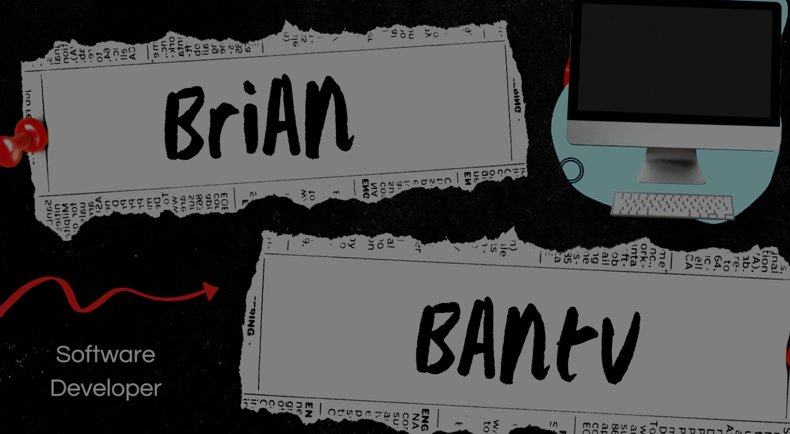

# Personal Portfolio Website

A modern, responsive portfolio website built with Go, featuring a clean design with animated waves, contact form, and robust error handling.




## 🚀 Features

- Clean, modern UI with animated wave effects
- Responsive design that works on all devices
- Contact form with validation
- Custom error pages (404, 500)
- Static file serving
- Robust error handling system

## 🛠️ Technologies Used

- Go (Golang) - Backend server
- HTML5/CSS3 - Frontend structure and styling
- SVG - Custom illustrations and animations

## 📋 Prerequisites

Before running this project, make sure you have:

- Go 1.16 or higher installed
- Git (for cloning the repository)
- A modern web browser

## 🔧 Installation & Setup

1. Clone the repository:
   ```bash
   git clone https://github.com/Bantu-art/Portfolio.git
   cd portfolio
   ```

2. Install dependencies (if any):
   ```bash
   go mod init portfolio
   go mod tidy
   ```

3. Create necessary directories:
   ```bash
   mkdir -p static/css static/js static/img templates
   ```

4. Project structure should look like this:
   ```
   portfolio/
   ├── main.go
   ├── cv/
   │   └── handlers.go
   ├── static/
   │   ├── css/
   │   │   └── style.css
   │   ├
   │   │   
   │   └── img/
   ├── templates/
   │   ├── index.html
   │   └── error.html
   ├── go.mod
   ├── go.sum
   └── README.md
   ```

## 🚀 Running the Application

1. Start the server:
   ```bash
   go run .
   ```

2. Open your browser and navigate to:
   ```
   http://localhost:8080
   ```

## 🔍 Testing Error Pages

To test the error handling:

1. 404 Error (Not Found):
   - Access any non-existent URL, e.g., `http://localhost:8080/nonexistent`

2. 500 Error (Server Error):
   - Temporarily rename or remove a template file:
     ```bash
     mv templates/index.html templates/index.html.bak
     ```
   - Refresh the page to see the 500 error
   - Remember to restore the file:
     ```bash
     mv templates/index.html.bak templates/index.html
     ```

## 📁 Project Structure

- `main.go` - Server initialization and route setup
- `cv/handlers.go` - Request handlers and error management
- `static/` - Static assets (CSS, images)
- `templates/` - HTML templates
  - `index.html` - Homepage template
  - `error.html` - Error page template

## 🛠️ Customization

1. Modify contact information:
   - Edit the contact details in `templates/index.html`

2. Change styling:
   - Update colors in `static/css/style.css`
   - Current theme colors:
     ```css
     :root {
       --primary-color: #023e8a;
       --secondary-color: #48cae4;
     }
     ```

3. Update error messages:
   - Modify error messages in `cv/`

## 🤝 Contributing

1. Fork the repository
2. Create your feature branch:
   ```bash
   git checkout -b feature/AmazingFeature
   ```
3. Commit your changes:
   ```bash
   git commit -m 'Add some AmazingFeature'
   ```
4. Push to the branch:
   ```bash
   git push origin feature/AmazingFeature
   ```
5. Open a Pull Request

## 📝 License

This project is licensed under the MIT License - see the [LICENSE](LICENSE) file for details.

## 📧 Contact

Brian Bantu - bribantu@gmail.com

Project Link: [https://github.com/Bantu-art/Portfolio.git](https://github.com/Bantu-art/Portfolio.git)

## 🙏 Acknowledgments

- Wave animation inspired by various codepen examples
- Error page robot illustration custom designed for this project
